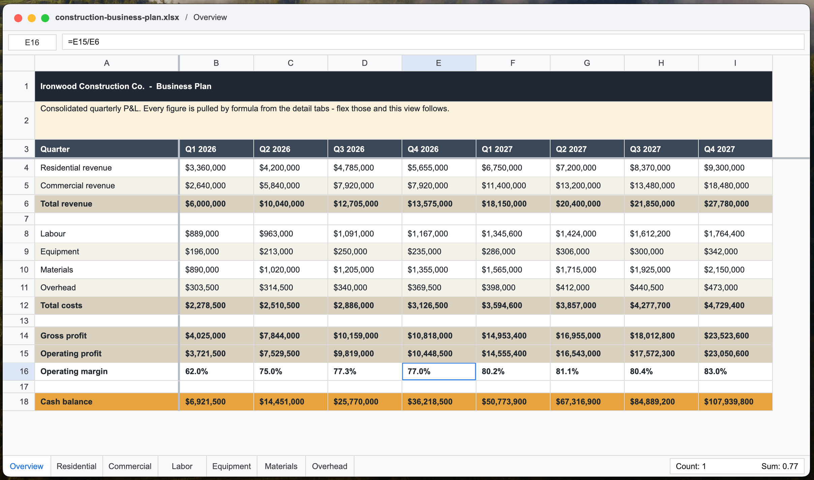
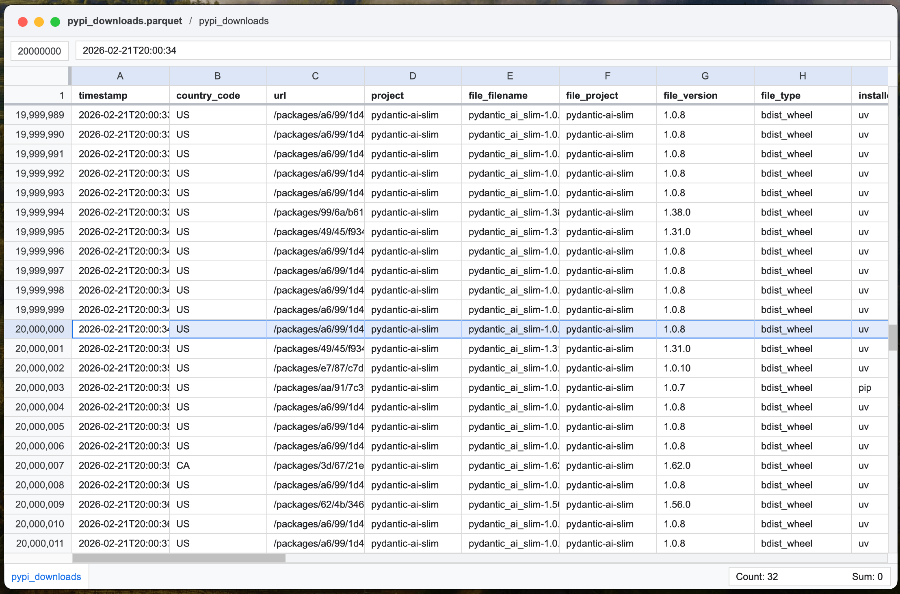

# spread

[](https://github.com/samuelcolvin/spread/actions/workflows/ci.yml)

A simple, fast spreadsheet viewer written in Rust using [GPUI](https://www.gpui.rs/).

Editing is not supported.

> [!NOTE]
> As with most things in 2026, the code here was almost entirely written by AI - using both Codex + GPT-5.5 and Claude Code + Opus 4.7 1M.

---

> [!NOTE]
> No PRs, they don't make sense on majority AI generated code like this. If you want a feature, please create an issue, if you really want to help, include the proposed prompt in the issue.

## Why

I wanted a quick way to view spreadsheets locally, without the need to open a document in Google sheets.

Features:

- supports CSV, Parquet, and XLSX file formats
- loads 30M row Parquet files in 112ms
- supports copy and paste to Google sheets or excel
- displays formatting such as dates, currency, percentages, bold text, colors, and column/row dimensions
- `--display xml` mode from the CLI to make it easy for LLMs to "view" spreadsheets

<p align="center">
  <br>
  <em>Example of rendering xlsx file</em>
</p>

<p align="center">
  <br>
  <em>Example of rendering large Parquet file</em>
</p>

## Install

Install the binary locally:

```sh
make install-macos
```

(If you're not on macOS, your mileage may vary, try `make install-cli` instead.)

On macOS, this also installs `Spread.app` to `~/Applications`, registers it with Finder, and sets it as the default app for `.xlsx`, `.csv`, and `.parquet` when [`duti`](https://github.com/moretension/duti) is installed. Without `duti`, use Finder's Get Info panel to choose Spread and click "Change All...".

### macOS build requirements

`gpui` compiles Metal shaders at build time, so full Xcode (not just the Command Line Tools) is required. If the build fails with `unable to find utility "metal"` or `missing Metal Toolchain`, run:

1. Install Xcode from the [Mac App Store](https://apps.apple.com/app/xcode/id497799835) (free, ~10 GB).
2. Launch it once and accept the license, then continue with the Metal Toolchain setup:

```sh
sudo xcodebuild -license accept
sudo xcode-select -s /Applications/Xcode.app/Contents/Developer
xcodebuild -downloadComponent MetalToolchain   # required on recent macOS even with Xcode installed
xcrun metal --version                          # verify the toolchain is reachable
cargo clean && make install-macos
```

## Usage

Then open a file with:

```sh
spread path/to/file.xlsx
```

or:

```sh
spread path/to/file.csv
```

or:

```sh
spread path/to/file.parquet
```

Useful CLI modes:

```sh
spread --list-sheets path/to/file.xlsx
spread --sheet Summary path/to/file.xlsx
spread --sheet 2 --display json path/to/file.xlsx
spread --sheet 2 --display xml path/to/file.xlsx
spread --sheet 2 --display table path/to/file.xlsx
spread --display audit path/to/file.xlsx
```

`--sheet` accepts a sheet name or 1-based sheet index. `--display` can be `gui`, `json`, `xml`, `table`, or `audit`.
